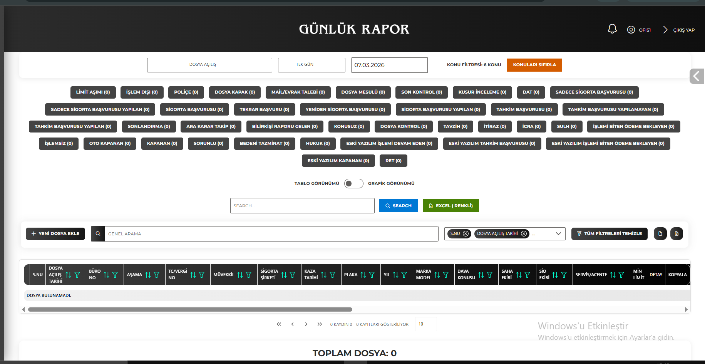
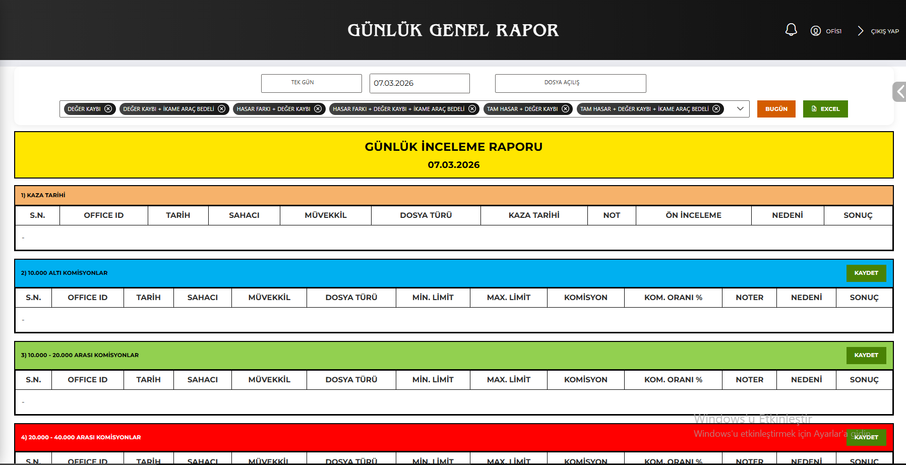
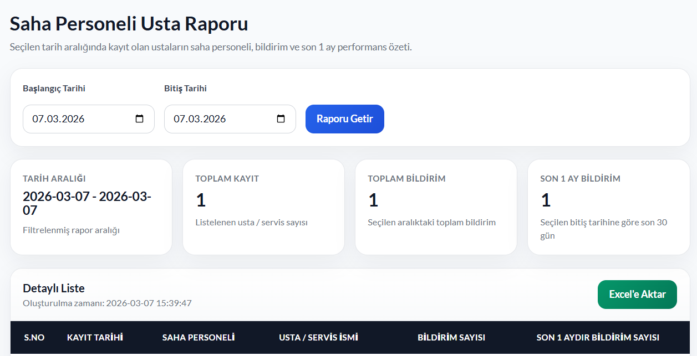
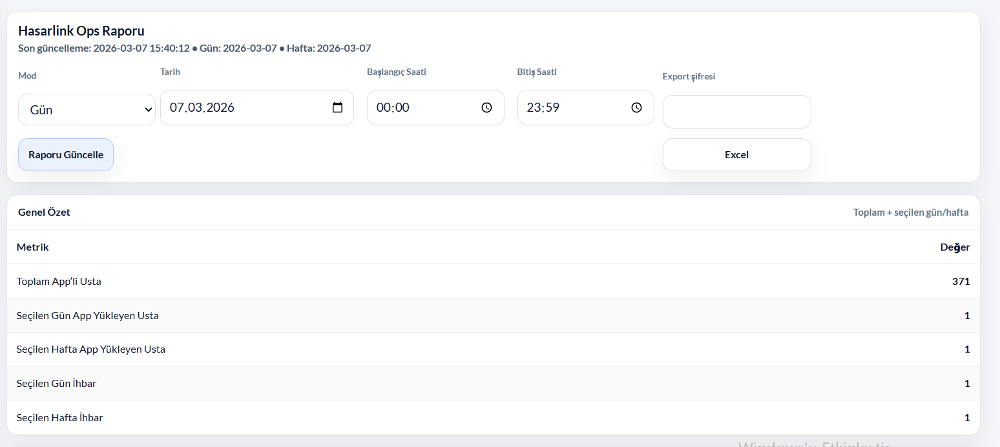
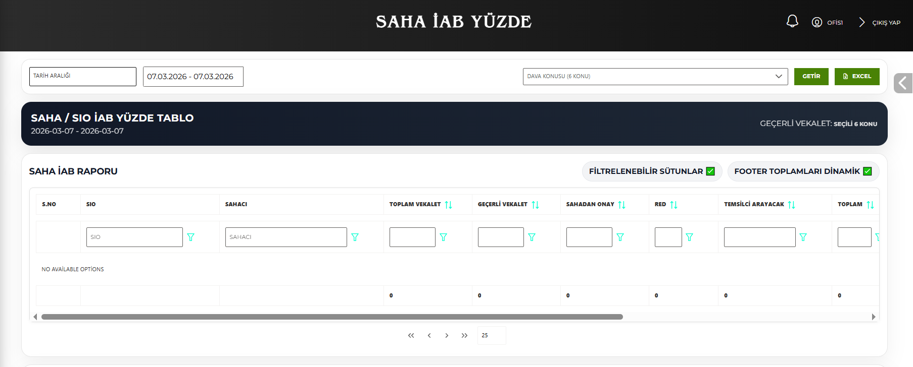
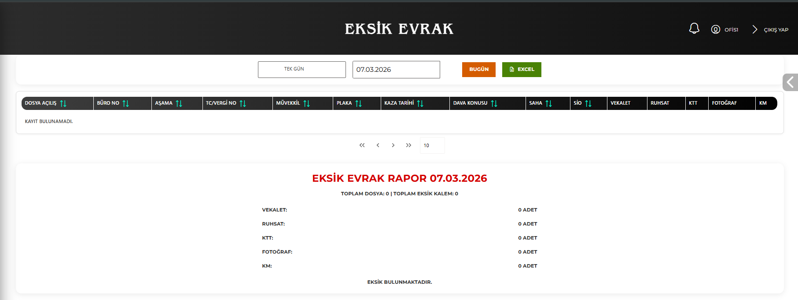
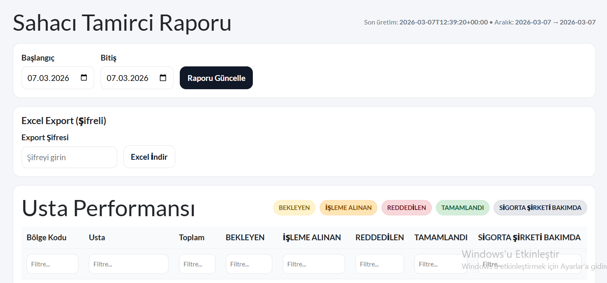

# Engineering Portfolio

This portfolio showcases backend systems, operational analytics platforms, and enterprise reporting tools that I designed and implemented.

My focus areas include:

- Backend architecture
- Operational analytics
- Product data reporting
- Workflow monitoring systems

---

# Insurance & Legal Operations Analytics Platform

I designed and implemented a large-scale reporting and analytics system for insurance and legal operations workflows.

The platform transforms operational processes into measurable KPIs and performance dashboards used by operational teams.

Key capabilities include:

- operational workflow monitoring
- performance dashboards
- KPI aggregation
- case tracking analytics
- Excel export pipelines
- data quality analysis

---

# Operational Reporting Dashboards

## Daily Operations Dashboard

This dashboard provides a daily overview of operational workflows and case progress across the system.

---

## General Operational Report

Aggregated operational statistics and workflow metrics used by management teams for monitoring daily system activity.

---

## Field Personnel Performance

Tracks performance metrics of field personnel and operational teams including workload distribution and case progress.

---

## Insurance Operations Monitoring

Operational analytics system designed to track insurance process metrics and workflow activity.

---

# Legal Workflow Analytics

## Monthly Power of Attorney Report

Provides operational insights for power-of-attorney workflows across field and office teams.

---

## Field Investigation Analytics

Tracks field investigation metrics and operational workflow status across legal case processes.

---

# Data Quality & Database Analysis Tools

## Field Usage Analyzer

A database analysis tool designed to evaluate field usage across application models.

The system identifies:

- unused database fields
- low usage attributes
- schema optimization opportunities

This helps improve database design and system performance.

---

# Case Workflow Monitoring

## Missing Document Tracking

Tracks missing documents within operational case workflows.

---

## Field Technician Report

Monitors technician workflow and case processing status.

---

# System Architecture

Typical architecture used in these systems:

Frontend  
React / Django templates

Backend  
Django REST APIs

Database  
PostgreSQL

Analytics Layer  
SQL aggregation queries

Export Layer  
Excel reporting pipelines
